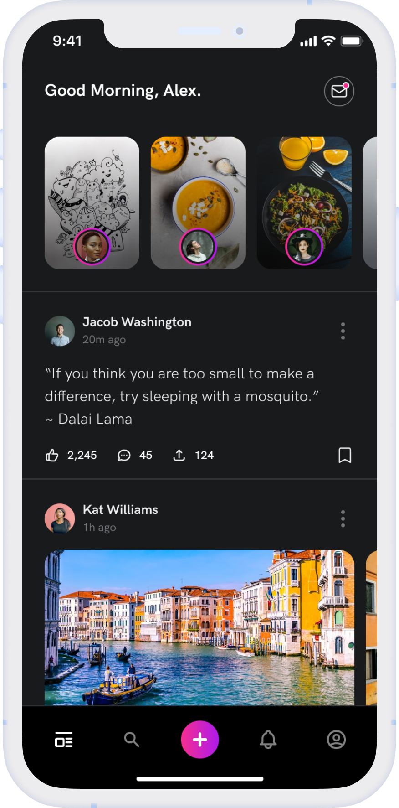
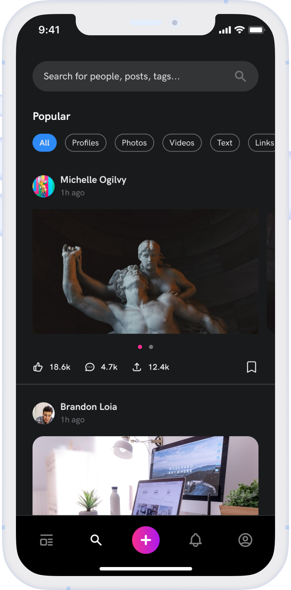
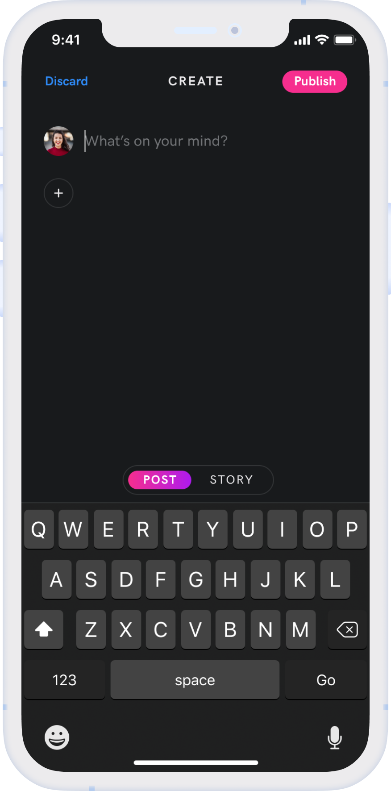
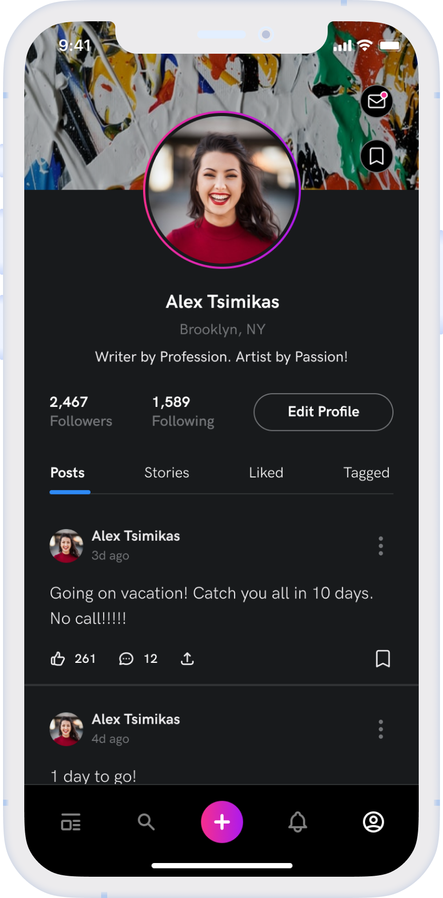
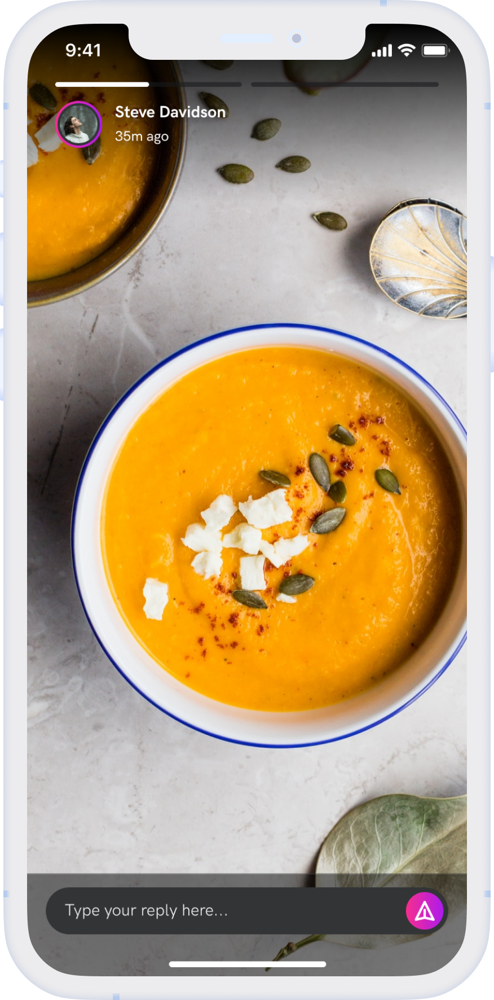
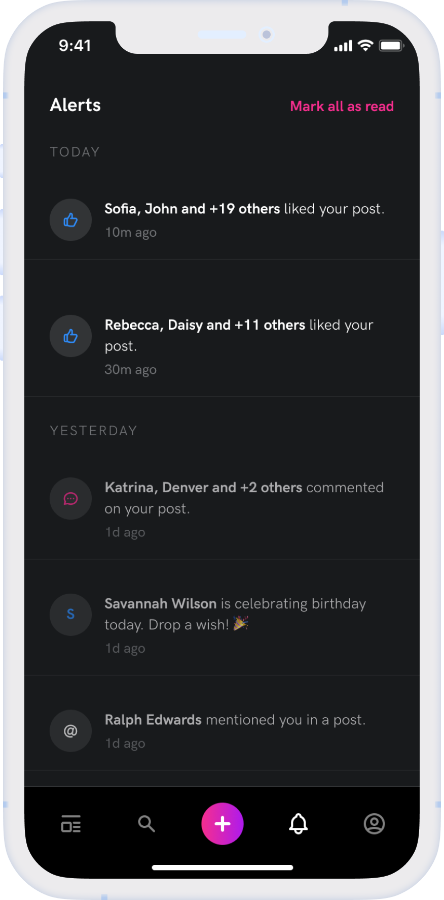

## Under Dvelopment

### About App

 Socials is a social media app built with flutter and firebase for authentication, real time database, cloud functions, firebase storage and firebase notification

# App Screenshot

 
 
 
 
 
 

<!--    

  

   -->